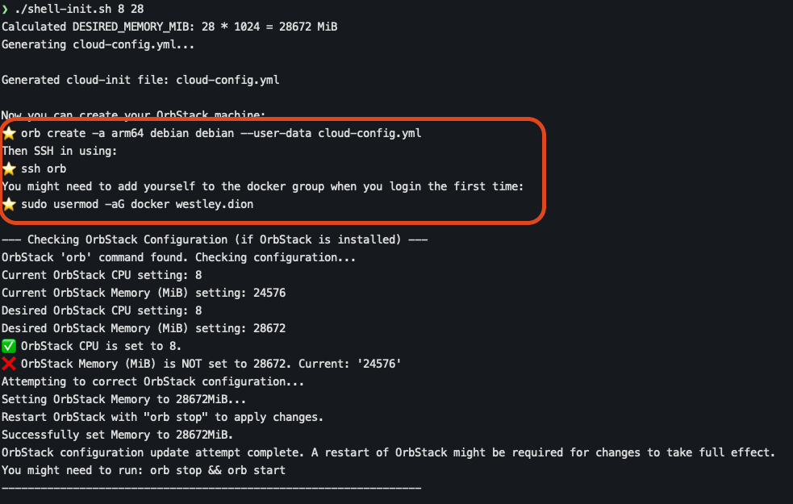
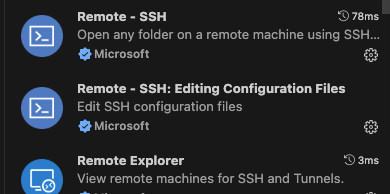
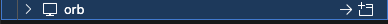
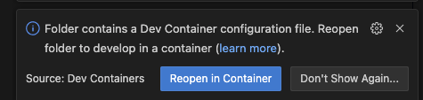
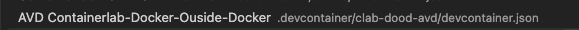

# cEOS-lab 101

This is a repository to help getting started with cEOS-lab in Containerlab. Use the Arista Community Central articles below as references to deploy your lab environments:

- https://arista.my.site.com/AristaCommunity/s/article/Getting-Started-with-cEOS-lab-in-Containerlab
- https://arista.my.site.com/AristaCommunity/s/article/cEOS-lab-in-Github-Codespaces
- https://arista.my.site.com/AristaCommunity/s/article/cEOS-lab-on-Orbstack
- https://arista.my.site.com/AristaCommunity/s/article/cEOS-and-Containerlab-on-Windows-WSL

## Arista cEOSarm setup

1. Install orbstack for mac

   ```
   brew install orbstack
   ```

2. Run osbstack config script. This will setup docker(Moby) and a few tools using cloud-init. It will set the CPU to 8 and Memory to 24 by default orbstack uses max cpu and 16 gigs of ram.
    ```
    cd scripts/debian
    ./shell-init.sh
    ```
    ```
    # (optionally set CPU and Memory. Example below 8 CPU and 28gigs of ram): 
    ./shell-init.sh 8 28
    orb stop
    orb start
    ```
    
3. Create arm VM
    
    ```
    orb create -a arm64 debian debian --user-data cloud-config.yml
    ssh orb
    sudo usermod -aG docker $USER
    ```
    
    
4. Login to vm and assign your user
    ```
    ssh orb
    sudo usermod -aG docker $USER
    ```
        

## Connecting with vscode
* plugin Dependencies remote 
  
  
1. VScode -> Remotes(Tunnels/SSH) -> orb -> Connect in new window
   
2. Open containerlab repo folder (ceos-101) from your mounted to host Folder: eg. /User/%username%/Project/repos/ceos-101
3. Choose reopen in container. Use the AVD Conatinerlab 
   
   
4. Select the .devcontainer file AVD
   
