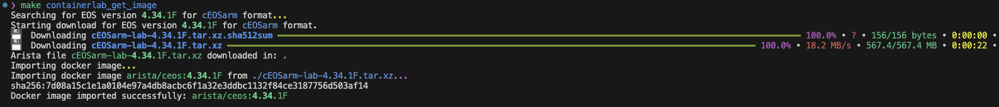

# Media and Entertainment

## setup .env file
Setup the .env file for api connections. Edit .env with tokens and varibles names
- ```
  cp .env-exmaple .env
  ```
## Containerlabs build
  
  ```
  make build
  ```
## Create Topology for ACT and ContainerLab
This will create 2 folders act/ and clab/ settings are in /playbooks/act_topgen.yml
- Creates containerlab with statup-configs linked to AVD indended configs
  ```
  make genTop
  ```
- Creates containerlab with default blank statup-configs
  ```
  make genTop_default
  ```

## Containerlab - Get and import ceosarm image
Using eos-downloader with api key from arista.com profile (set in .env file)
- ```
  make containerlab_get_image
  ```
  

## Containerlab - deploy lab
deploy containerlab from clab/
- ```
  make containerlab_deploy
  ```
  

